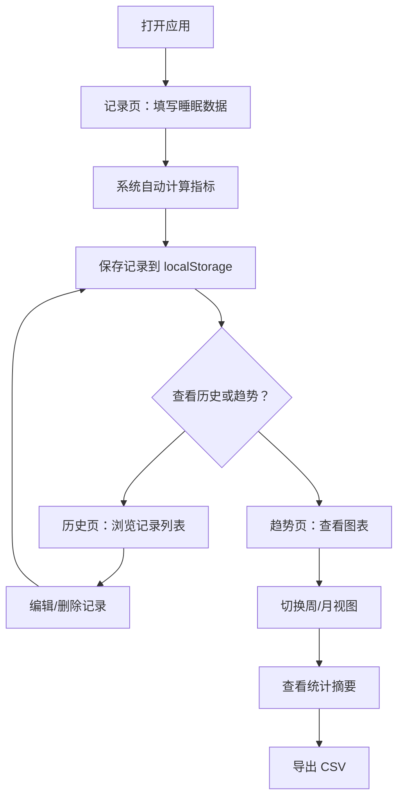

## 1. 产品概述

睡眠记录工具是一款帮助用户追踪和分析睡眠质量的纯前端应用。用户每日记录关键睡眠指标，系统自动计算睡眠效率等衍生数据，并通过可视化图表展示长期趋势，让用户直观了解自己的睡眠状况。

- 解决问题：帮助用户量化睡眠、发现睡眠规律、改善睡眠习惯
- 目标用户：关注睡眠健康的普通用户、有睡眠困扰的人群

## 2. 核心功能

### 2.1 用户角色
无需角色区分，单用户本地使用，数据存储在浏览器 localStorage。

### 2.2 功能模块
1. **记录页**：睡眠数据录入表单，支持新增和编辑
2. **历史页**：睡眠记录列表与详情查看，自动计算指标展示
3. **趋势页**：周/月趋势图表，展示睡眠时长和入睡时间变化
4. **导出功能**：将记录数据导出为 CSV 文件

### 2.3 页面详情

| 页面名称 | 模块名称 | 功能描述 |
|---------|---------|---------|
| 记录页 | 时间输入区 | 输入上床时间、入睡时间、起床时间 |
| 记录页 | 可选输入区 | 输入醒来次数（可选）、睡眠质量自评（1-5星） |
| 记录页 | 自动计算展示区 | 实时展示卧床时长、实际睡眠时长、睡眠效率 |
| 历史页 | 记录列表 | 按日期倒序展示所有记录，显示核心指标 |
| 历史页 | 记录详情/编辑 | 点击记录查看详情或编辑 |
| 历史页 | 删除确认 | 支持删除单条记录 |
| 趋势页 | 时间范围选择 | 切换周视图/月视图 |
| 趋势页 | 睡眠时长图表 | 折线图展示每日睡眠时长变化及平均线 |
| 趋势页 | 入睡时间图表 | 折线图展示入睡时间变化趋势 |
| 趋势页 | 统计摘要 | 展示平均睡眠时长、平均入睡时间、平均睡眠效率 |
| 全局 | 导出按钮 | 导出所有记录为 CSV 文件 |

## 3. 核心流程

用户打开应用 → 进入记录页填写昨晚睡眠数据 → 系统自动计算卧床时长、实际睡眠时长、睡眠效率 → 保存记录 → 在历史页查看过往记录 → 在趋势页查看周/月趋势图表 → 按需导出数据

## 4. 用户界面设计

### 4.1 设计风格
- **主色调**：深靛蓝（#1E1B4B）搭配月光银（#E2E8F0），营造夜空宁静感
- **辅助色**：薰衣草紫（#7C3AED）、晨曦橙（#F59E0B）用于强调和图表
- **按钮风格**：圆角胶囊按钮，柔和阴影，hover 时微微上浮
- **字体**：标题使用 DM Serif Display（优雅衬线体），正文使用 DM Sans（简洁无衬线体）
- **布局风格**：左侧垂直导航栏 + 右侧内容区，卡片式内容展示
- **图标风格**：Lucide 线性图标，轻量优雅
- **整体氛围**：深色主题为主，星光/月亮装饰元素，渐变背景模拟夜空

### 4.2 页面设计概览

| 页面名称 | 模块名称 | UI 元素 |
|---------|---------|---------|
| 记录页 | 时间输入区 | 深色卡片，时间选择器，渐变边框高亮选中 |
| 记录页 | 质量评分区 | 5颗星形按钮，选中时带发光效果 |
| 记录页 | 计算结果区 | 数据卡片组，数字大号展示，带渐变色指标条 |
| 历史页 | 记录列表 | 日期分组，卡片式记录，滑动删除 |
| 趋势页 | 图表区 | 折线图，渐变填充区域，悬浮提示框 |
| 全局 | 侧边导航 | 深色侧栏，图标+文字，选中项带渐变指示条 |

### 4.3 响应式设计
- 桌面端优先（1024px+）：左侧导航 + 右侧内容
- 平板端（768px-1024px）：侧栏折叠为图标模式
- 移动端（<768px）：底部标签栏导航，单列布局

### 4.4 3D 场景
不适用
