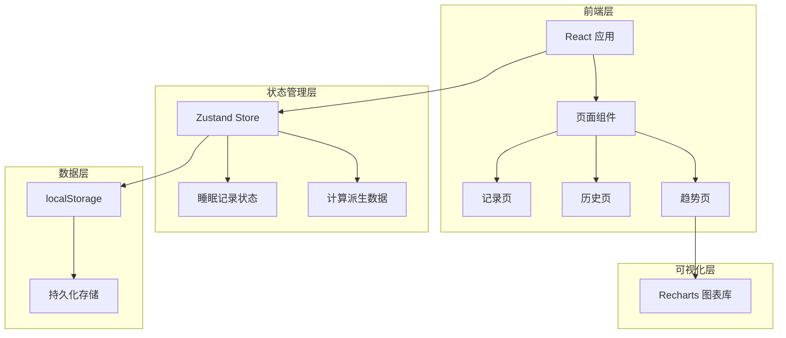
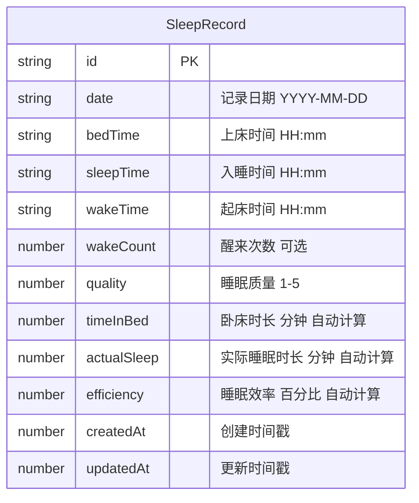

## 1. 架构设计



## 2. 技术说明
- 前端：React@18 + TypeScript + Tailwind CSS@3 + Vite
- 初始化工具：vite-init（react-ts 模板）
- 状态管理：Zustand（含 persist 中间件自动同步 localStorage）
- 图表库：Recharts（轻量 React 图表库）
- 图标：lucide-react
- 后端：无（纯前端应用）
- 数据库：localStorage（浏览器本地存储）

## 3. 路由定义

| 路由 | 用途 |
|------|------|
| / | 重定向到 /record |
| /record | 睡眠记录录入/编辑页 |
| /history | 睡眠记录历史列表页 |
| /trends | 周/月趋势图表页 |

## 4. API 定义
无后端 API，所有数据操作通过 Zustand store 在前端完成。

## 5. 服务器架构
不适用（纯前端应用）

## 6. 数据模型

### 6.1 数据模型定义



### 6.2 数据定义语言

```sql
-- 概念模型（实际存储为 localStorage JSON）
CREATE TABLE sleep_records (
  id TEXT PRIMARY KEY,
  date TEXT NOT NULL UNIQUE,
  bed_time TEXT NOT NULL,
  sleep_time TEXT NOT NULL,
  wake_time TEXT NOT NULL,
  wake_count INTEGER,
  quality INTEGER NOT NULL CHECK(quality BETWEEN 1 AND 5),
  time_in_bed INTEGER NOT NULL,
  actual_sleep INTEGER NOT NULL,
  efficiency REAL NOT NULL,
  created_at INTEGER NOT NULL,
  updated_at INTEGER NOT NULL
);
```

### 6.3 计算逻辑
- **卧床时长** = 起床时间 - 上床时间（跨天自动处理）
- **实际睡眠时长** = 起床时间 - 入睡时间（跨天自动处理）
- **睡眠效率** = 实际睡眠时长 / 卧床时长 × 100%
- **跨天处理**：如果起床时间 < 上床时间/入睡时间，则起床时间视为次日
